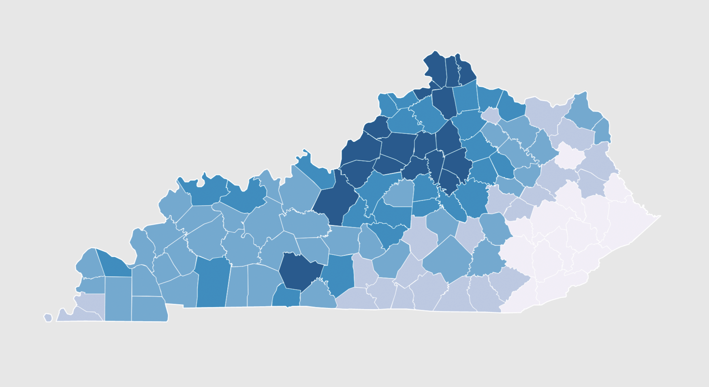

# Lesson 09: Creating a Dynamically Drawn Choropleth Map

## Goals

You will discover how to style a GeoJSON layer by dynamically classifying its attribute data. You will learn how to add a legend and additional GeoJSON layers to make a polished choropleth map. 

## Table of Contents

<!-- TOC -->

- [Lesson 09: Creating a Dynamically Drawn Choropleth Map](#lesson-09-creating-a-dynamically-drawn-choropleth-map)
    - [Goals](#goals)
    - [Table of Contents](#table-of-contents)
    - [Overview](#overview)
    - [Using jQuery](#using-jquery)
    - [Dynamic loading data using jQuery's AJAX request](#dynamic-loading-data-using-jquerys-ajax-request)
    - [Drawing data to the map](#drawing-data-to-the-map)
        - [Choropleth mapping in Leaflet](#choropleth-mapping-in-leaflet)
        - [Classifying data and coloring the map](#classifying-data-and-coloring-the-map)
    - [Scripting a Dynamic Legend for a Choropleth Map](#scripting-a-dynamic-legend-for-a-choropleth-map)
    - [Adding additional GeoJSON layers](#adding-additional-geojson-layers)
    - [Flow of execution](#flow-of-execution)
    - [Addendum I: full-screen mobile-friendly maps](#addendum-i-full-screen-mobile-friendly-maps)
        - [Add and enable overlay](#add-and-enable-overlay)
    - [Addendum II: Using Vanilla JavaScript for AJAX](#addendum-ii-using-vanilla-javascript-for-ajax)
        - [Fetch](#fetch)
        - [XMLHttpRequest (XHR)](#xmlhttprequest-xhr)

<!-- /TOC -->

## Overview

This lesson will instruct you on how to create a dynamically generated choropleth map in Leaflet with an accompanying legend. It also explains how to use the jQuery JavaScript library to load an external data file using AJAX.

You'll be modifying the index file within the *lesson-09/* directory as you follow along with this lesson to produce the choropleth map. Save your changes to your *lesson-09/index.html* file and **commit changes to your local GitHub repository** as you work. (**4 pts**).

You'll be creating a similar map with different geography and data attribute for [Lab 09](lab-09/).


## Using jQuery

[jQuery](https://jquery.com/), like Leaflet, is a library written in JavaScript intended to simplify web programming. It's particularly efficient at selecting and modifying DOM/HTML elements, dynamically applying style rules to these HTML elements, and handling user interaction events. 

Since 2006 when jQuery was invented, newer libraries and frameworks (e.g., [React](https://reactjs.org/)) have replaced the need for jQuery. The most popular parts of jQuery are even included in the latest version of JavaScript, which will be eventually adopted by all browsers. jQuery technology remains relevant today because it is the most widely used library and forms the foundation of powerful web design frameworks like [Bootstrap](https://getbootstrap.com/).

We load jQuery in the same way as we did with Leaflet, using the `<script src=" …` in the head of the document. While we could easily save jQuery to a local file, we can also use the version hosted on a remote server. This approach to loading remotely hosted JavaScript libraries such as jQuery makes use of what is known as a Content Delivery Network, or CDN.

To include jQuery in our project, we include the path to the most recent version (or whichever version we wish) of jQuery, along with Leaflet:

```html
<!-- add jQuery JS script -->
<script src="https://code.jquery.com/jquery-3.5.1.min.js"></script>
<script src="https://unpkg.com/leaflet@1.7.1/dist/leaflet.js"></script>
```

That's it! Now we have the full power of jQuery at our disposal. Let's point out that jQuery has a standard way of accessing all its methods. Remember how we access Leaflet's methods using the capital letter `L`? With jQuery, we can write `jQuery` or, for shorthand and more commonly, the dollar sign symbol `$`.

While we won't go into this much now, an example of using jQuery would be to select our `<h1>` element within our web document, and dynamically change its content (within our `<script></script>` tags).

```javascript
jQuery("h1").html("Housing Ownership in Kentucky");
```
 or

```javascript
$("h1").html("Housing Ownership in Kentucky");
```

The result, when we refresh our web browser, is that upon the page load jQuery has selected the h1 tag and dynamically updated the content:

  
*Dynamically updated h1 content*

jQuery offers many exciting possibilities for enriching user experience, as well as an extended [jQuery UI](https://jqueryui.com/) library. For now, we're going to use it to dynamically load some data into our document for use with our Leaflet map.

## Dynamic loading data using jQuery's AJAX request

So far within MAP672 we've loaded an external GeoJSON file into our script at runtime by creating that file as a JavaScript file and using the HTML `src` attribute (e.g., `<script src="power-plants.js"></script>`). Moving forward, we'll be using a different approach to get our data into our maps: a technique known as **asynchronous JavaScript and XML (AJAX)**.

AJAX is a techie buzzword and involves several different web technologies such as JavaScript, the Document Object Module (DOM), and server requests (XMLHttpRequests). Ironically, it often does not involve XML (eXtensible Markup Language). The critical thing to understand for now is that an AJAX request occurs after the page has loaded and enables a web application (such as our map) to load data or files without refreshing the page.

AJAX is slick in this way and allows for more seamless user experience as information is loaded and updated within a page without it being overly obvious. Google Maps, for instance, pioneered this technique when it introduced its tile-based slippy maps in 2005. We are loading only the tiles that are being displayed in the current viewport, which drastically increases the page load time. As the user pans or zooms around the map, new tiles are loaded on the fly using AJAX. For further reading on AJAX, see Garrett's now classic explanation written back in 2005 ([http://www.adaptivepath.com/ideas/ajax-new-approach-web-applications/](http://www.adaptivepath.com/ideas/ajax-new-approach-web-applications/)).

Take note that within this lab's data directory (*lab-09/data/*), there is a file named *ky_counties_housing.json*, which contains both geometry information for Kentucky counties and information about housing units in Kentucky collected in the 2010 census, aggregated to these county levels. You can examine the data contained within this text-based GeoJSON file within a text editor:

  
*GeoJSON data of Kentucky housing*

Note that beyond the latitude and longitude coordinates eroded for each county, there are also several data attributes with both string and strings that can be converted to numerical type values (e.g., `"NAME": "Ohio", "TOTAL": "10219", "OCCUPIED": "9176", "VACANT": "1043"`). The meanings of these data attributes are noted within the *ky_counties_housing.txt*. Als be aware of how the data is encoded. A number can be encoded as string, but, in some circumstances, you should explicitly change the string to a number.

Rather than load this file as JavaScript, as we did with the power plants data in MAP672, we want to use our JavaScript to request this file after the page has loaded and made it available to us to use within the Leaflet map.

To do so, let's begin by writing JavaScript within our `<script></script>` tags toward the bottom of the starter *index.html* template included within the *lab-09/* data directory.

Note that as usual, we're first creating a Leaflet map using the `var map = L.map('map')` constructor, as well as passing it some options.  This time, we'll omit the slippy map tiles, as well as remove the Leaflet *zoomControl*, effectively disabling the pan/zoom functionality of the map using the following Leaflet map options:

```javascript
var options = {
    center: [37.8, -85.8],
    zoom: 7.4,
    zoomSnap: .1,
    zoomControl: false
}
var map = L.map('map', options);
```

We've centered the map on Kentucky. Note that we've chosen a zoom level of 7.4. When we want finer granularity of zoom levels in Leaflet, we also need to include the `zoomSnap` option where a value of `1` snaps the zoom to full integers, and `0.1` provides greater granularity. 

Also, note that we've removed the default zoom controls, for now, using `zoomControl: false`. We'll add them back later on the right side of the screen.

We could also add a basemap tile layer to our leaflet map, but it's not always necessary. In fact, if we added a basemap tile layer, the fractional zooming does not work with raster tiles. This lesson will continue with examples not using a basemap, but feel free to add one if you wish.

Next, let's load the *ky_counties_housing.json* file into the document. While jQuery has methods for loading data of various formats into the document ([http://api.jquery.com/category/ajax/](http://api.jquery.com/category/ajax/)), we see that there is one designed particularly for loading JSON-encoded data ([http://api.jquery.com/jquery.getjson/](http://api.jquery.com/jquery.getjson/)), the `getJSON()` method.

We access jQuery's `getJSON()` method using dot notation (in the same way we access all of Leaflet's methods). The method passes two arguments:

1. the first being a string containing the URL of the file we're requesting (here a file named *ky_counties_housing.json* within a directory named *data/* relative to our *index.html* file), and 
2. the second being a callback function that executes once the script successfully loads the data. We access our asynchronously loaded data within this callback function.

```javascript
$.getJSON("data/ky_counties_housing.json", function(data) {
  // the data loaded from the file is accessible here within this function scope!
  console.log(data);
});
// `data` parameter is not accessible here!
```

If we inspect our Console output in the browser, we recognize the GeoJSON data from within the *ky_counties_housing.json* file (again, you can examine these data within a text editor as well and note the mirrored data structure between the *.json* file contents and what we've now loaded into our script).

  
*Output of the AJAX-loaded GeoJSON data*

We now have our data loaded into the document, and we're ready to map!

## Drawing data to the map

Within our callback function, we can immediately and easily create a Leaflet GeoJson layer with the GeoJSON data and add it to the map:

```javascript
$.getJSON("data/ky_counties_housing.json", function(data) {
  L.geoJson(data).addTo(map);
});
```

The result is the (reasonably unattractive ) map drawn with the default Leaflet path options:

  
*GeoJSON data drawn with default Leaflet path options*

Remember that we can apply some style rules as options when we first create our Leaflet GeoJson layer. For now, let's reduce the default weight of the stroke (the unit borders) to 1 and change its color to match the background of the map element. This is a subtle and effective design choice speaking to what's known as **figure-ground perception**. Think about what rises to the foreground of the "visual hierarchy." If we make our borders darker and thicker than the counties, then they will "pop" out more, or rise above the counties. But we're not interested in mapping borders. We want the counties to rise to the "figure" and the borders and area outside of Kentucky to fall to the background of the visual hierarchy and to become the "ground."

Since we intend to make a choropleth map, let's change the fillOpacity of the GeoJson features to 1 (100%) and add a temporarily fill color (this could be left blank, as we'll be assigning fill colors later based up data attribute values).

```javascript
L.geoJson(data, {
  style: function(feature) {
  return {
      color: '#dddddd',
      weight: 1,
      fillOpacity: 1,
      fillColor: '#1f78b4'
    };
  }          
}).addTo(map);
```
  
*Kentucky county map with basic styles*

### Choropleth mapping in Leaflet

Choropleth maps are another common type of thematic map that use enumeration units such as states or counties to show how much of a particular phenomenon each contains by proportional shading. These are among the most familiar of thematic map types to the general public, especially for making election maps.

Choropleth maps are best used to map continuous areal (or area-based) phenomena and represent a statistical surface for enumeration units (i.e., polygons). The map symbology applies a sequence of shaded values (often using color schemes) to symbolize the density or ratio for each enumeration unit on the map. The intensity of the color indicates how much of some phenomenon is within a given area (greater intensity or darker color generally means more of something).

To make a choropleth map, we need to establish two more pieces of information. First, we need to know the entire range of the particular data value we're encoding. Second, we need to determine the precise values with which we will classify that data range into discrete chunks. We could do some of this analysis before creating our GeoJSON file, either through analyzing the data tables within a conventional spreadsheet application such as OpenOffice Calc or Microsoft Excel. We could also run scripts written in JavaScript, Ruby, Python, or R to process our data and create attribute values that are normalized. However, for this module, we are going to do this analysis and determine the class breaks client-side at runtime using JavaScript.

Because of the asynchronous aspect of the jQuery `getJSON()` method, we know that access to our data is available only within this callback function when the script has successfully loaded. We could, therefore, continue to write our entire script within the method's callback function. But instead, let's call a new function

To do so, we'll declare a variable named `dataLayer` and assign our Leaflet GeoJson layer to it within the callback function. We can then use that variable as an argument when calling a new function `drawMap()`. This is how we control when and where our data is accessible to us within the script.

```javascript
var countyLayer = $.getJSON("data/ky_counties_housing.json", function(data) {

  var dataLayer = L.geoJson(data, {
    style: function(feature) {
      return {
          color: '#dddddd',
          weight: 1,
          fillOpacity: 1,
          fillColor: '#1f78b4'
      };
    }          
  }).addTo(map);

  // call to new function here gets the data out of the
  // callback function
  drawMap(dataLayer); 
});
```

Note that we also added the jQuery `getJSON()` method to a variable. This gives us the opportunity reference this action later in the script. For example, if we wanted to add additional layers, we need to know when this layer has completely loaded before adding a second layer. We'll address jQuery's `.when()` and `.done()` methods at the end of the module.

Once we make these additions, we need to declare and define this `drawMap()` function outside (and written below, for the sake of legibility) the `getJSON()` function's callback function. This function, of course, needs to accept the argument (i.e., accept the `dataLayer` as a parameter).

```javascript
function drawMap(dataLayer) {

    // we now have access to dataLayer here!

}
```

### Classifying data and coloring the map

The nice thing about having already drawn our Kentucky counties GeoJSON to the Leaflet map is that now, rather than redrawing this map, we can loop through all its feature layers and update their fill color. Looping through the existing features is quite simple, as we can use the convenient Leaflet method `.eachLayer`. For example, we could  color all the county polygons yellow with the following code using Leaflet's `setStyle` method:

```javascript
function drawMap(dataLayer) {

  dataLayer.eachLayer(function(layer) {

    layer.setStyle( { fillColor: 'yellow' } );

  });
} // end drawMap()
```

The result is that all the polygons have been given a new fill color after we initially drew them.

  
*Polygons dynamically colored yellow*

However, rather than giving them all the same color, we want to assign a color based on a given data attribute (for this example, housing units owned with a mortgage).  How can we access this information? If you recall from MAP672, as we loop through each "layer" (i.e., polygon) we can access the feature's attribute information by digging down into the JSON structure. For instance, let's log each layer to the Console:

```javascript
function drawMap(dataLayer) {

  dataLayer.eachLayer(function(layer) {

    console.log(layer);

  });
} // end drawMap()
```

We can then examine the output in our browser's Console and find the path within the nested JSON structure. Note that within each layer, we store the attribute information within a value accessed through the key `feature` and then within `properties`. This animated GIF shows how we can inspect the Console output in the browser and see how we can access our values through `layer.feature.properites`:

  
*Digging down into the JSON layer properties*

Therefore, we can access this information using

```javascript
function drawMap(dataLayer) {

    dataLayer.eachLayer(function(layer) {

        console.log(layer.feature.properties);

    });

} // end drawMap()
```

Now we know we can dynamically access this information. But how do we use that information to color the polygon units? Recall that choropleth maps assign a particular color to individual units when its attribute value falls within a specific range (e.g., a hex value of `#a6bddb` for any attribute values that fall between 10 and 20). We need to determine the "class breaks" that constitute these ranges before we can assign a color.

Within our `drawMap()` function, declare a variable named `breaks` and assign to it a function we'll create and appropriately name `getClassBreaks()`.  This function which will determine the range of values given the specific data attribute we wish to map (e.g., "OWNER_MORT") and return an array of specific classification breaks, which will be assigned to our local variable `breaks` within the `drawMap()` function. So far, our code should look like this (note that we can remove that `console.log()` statement):

```javascript
function drawMap(dataLayer) {

  var breaks = getClassBreaks(dataLayer);

}

function getClassBreaks(dataLayer) {

  // code here to determine range and establish classification breaks
}        
```

**Question:** How do we first get the entire range of data values and establish the class breaks? To do this, we need to pull all the appropriate data values (e.g., those encoded with the key of `"OWNED_MORT"`) out of our nested JSON and store these temporarily in the script. We can loop through the `dataLayer` (i.e., the Leaflet GeoJson layer we created in the callback function above) and then push values from each feature into an array.

Within the *getClassBreaks* function body, we first create an empty array (here named `values`) that will hold all the entire range of data values. We then loop through all the feature layers using Leaflet's *eachLayer* method and access the values we want using the nested JSON structure and a combination of dot and bracket notation (in the same way we just demonstrated).

While we could "hard-code" these intended attributes values into the script here, it will offer us more flexibility to assign these as variables. Where should we do this? Let's create two global variables (toward the top of the script before we load the data) that we'll name `attributeValue` and `normValue` and assign string values of as "OWNED_MORT" and "OWNER", respectively.

Add the `attributeValue` and `normValue` variables to your script, just above the jQuery method that loads our data:

```javascript
var attributeValue = "OWNED_MORT",
    normValue = "OWNER";

// $.getJSON() here
```

We can now use these global variables to calculate the normalized value we want (i.e., the number of housing units owned with a mortgage or loan divided by the total number of housing units). We then push this calculated value into our array using the native JavaScript array `push()` method.

```javascript
// empty array to hold all our values
var values = [];

dataLayer.eachLayer(function(layer) {
  // shorthand reference to properties
  var props = layer.feature.properties 

  // calculate the normalized value
  var value = props[attributeValue]/props[normValue];
  
  // push that value to the array
  values.push(value);   
});

console.log(values); // verify in the Console
```

We should be mindful of the problems we might have with our data. If a `null` value existed in any attribute value, the calculated value would be `null`. Or, if the denominator was a `0`, the script would throw an error. So, before pushing data into an array or performing a calculation, test the data, e.g., `if (props[normValue] != 0)` and `if (value != null)`. We can inspect the result of this computation with a `console.log()` statement, and the result is an array with a calculated value for each of our 120 Kentucky counties:

  
*Output of the range of values pushed to an array*

Now that we have all our data values stored within an array, how we determine the classification breaks? As we know, there are various ways to classify our data, and the method will drastically change the resultant map (see the example here: [http://bl.ocks.org/tmcw/4969184](http://bl.ocks.org/tmcw/4969184)). For a refresher on choosing an appropriate data classification method, read [The Basics of Data Classification](http://axismaps.github.io/thematic-cartography/articles/classification.html).

For this example, we'll be using a newer classification method known as [ckmeans](https://journal.r-project.org/archive/2011-2/RJournal_2011-2_Wang+Song.pdf). Similar to the "Jenks" or "natural breaks" algorithm, the ckmeans method seeks to minimize differences within groups. In other words, it will find the values that cluster together and group these.

The problem is, implementing either the Jenks or ckmeans method involves some fairly difficult formulas to wrap our heads around, much less code in JavaScript. The good news is, we can again rely on the smart people within the open source community to do the heavy lifting for us! Web map developer Tom Macwright wrote a useful JavaScript library called [Simple Statistics](http://simplestatistics.org/), [which contains a method *ckmeans* ](https://simplestatistics.org/docs/#ckmeans) that accepts input data as an array of numbers and the desired amount of clusters, from which we can derive the class breaks. Perfect! How then do we use this library?

To utilize the jQuery and Leaflet libraries, we've used the `<script src="` HTML code and a full URL path to the code hosted on a CDN. Like other libraries, Simple Statistics too is hosted on a CDN. We simply include another line in the head of our document and provide a link to *simple_statistics.js* :

```html
<script src="https://code.jquery.com/jquery-3.5.1.min.js"></script>
<script src="https://unpkg.com/leaflet@1.7.1/dist/leaflet.js"></script>
<!-- add the simple stats library -->
<script src="https://unpkg.com/simple-statistics@7.2.0/dist/simple-statistics.min.js"></script>

```

Once that JavaScript code within the *simple_statistics.js* file is available to us, we can access all of its methods with `ss` (similar to how `L` refers to Leaflet or the `$` sign refers to jQuery). So, once our `getClassBreaks()` function first determines the range of values and stores these in an array (here stored with a variable named `values`), we can determine five classification breaks using a method call written as `ss.ckmeans(values,5)`.  This method returns a 2-dimensional array, that is, an array of arrays. Within each array is a cluster of similar values we'll want to use for a given class on our map.

To color our map and build our legend, however, we want specific values to use as breakpoints and not clusters of values. So we'll need our script to pull specific values from each of these clusters. But which ones? We can think of each cluster as a single class (i.e., will be colored the same) on our map.  We then want an array of the lowest value from each cluster, as well as the highest value in the range (we could also collect the lowest value in the range and the highest value in each cluster). To do so, we'll store our array of clusters as a variable and then invoke the [native JavaScript method `.map()`](https://developer.mozilla.org/en-US/docs/Web/JavaScript/Reference/Global_Objects/Array/map) on this variable. This method creates a new array comprising the results of a function's operations on each element of an array.

In this case, we want to return the first element of each cluster (the `ss.ckmeans()` method returns values within these clusters ascending from lowest to highest). Therefore, the following code will pull the first element out of each cluster (using the bracket notation and the zero for the first element, `cluster[0]`) as well as the last element (using the native [JavaScript `pop()` method](https://developer.mozilla.org/en-US/docs/Web/JavaScript/Reference/Global_Objects/Array/pop)) and append that 2 element array to a new array we'll name `breaks`. Again, it's useful to log the result to the Console for inspection.

```javascript
// determine similar clusters
var clusters = ss.ckmeans(values, 5);

// create an array of the lowest value within each cluster
var breaks = clusters.map(function(cluster){
  return [cluster[0],cluster.pop()];
});

console.log(breaks); // verify your break values
```

This code results in an array stored as `breaks` that contains the low values of each class range, as well as the highest value of the entire dataset. We can return the resultant class breaks array to where it was called, the *getClassBreaks* function. You may again even wish to `console.log(breaks)` before the return statement to see the results. Our updated (complete) `getClassBreaks()` function now looks like this:

```javascript
function getClassBreaks(dataLayer) {

  // create empty Array for storing values
  var values = [];

  // loop through all the counties
  dataLayer.eachLayer(function(layer) {
    var props = layer.feature.properties;
    var value = props[attributeValue]/props[normValue];
    values.push(value);  
  });

  // determine similar clusters
  var clusters = ss.ckmeans(values, 5);  

  // create an array of the lowest value within each cluster
  var breaks = clusters.map(function(cluster){
    return [cluster[0],cluster.pop()];   
  });

  return breaks; // return Array of class breaks
} // end getClassBreaks function
```

Now that we have our classification breaks for a given range of data attribute values, we can use these to first color our Kentucky county polygons. Within our *drawMap* function, after we determine the class breaks, we can loop through each layer of our *dataLayer* and apply Leaflet's *setStyle* method to each layer to update the fill color of each. Similarly, as we dynamically assigned a radius size to our proportional symbols in MAP672, now we will assign a function call as the property value to the `fillColor` property name (thereby assigning a string encoding a hexadecimal color value returned from that function call). We'll name this function *getColor*, and we'll pass it two arguments: 1) the calculated value for each polygon and 2) the derived class breaks.

```javascript
  var breaks = getClassBreaks(dataLayer);

  dataLayer.eachLayer(function(layer) {
    
    var props = layer.feature.properties;

    layer.setStyle({
      fillColor: getColor(props[attributeValue]/props[normValue], breaks)
    });
  });
```

Before this code works, however, we need to create the *getColor* function. This function accepts the calculated value and the array of classification breaks. It then either uses a serious of if/else if statements (or a switch statement such as in the [Leaflet Interactive Choropleth Map example](http://leafletjs.com/examples/choropleth.html) to determine which class a particular county's value falls within. It then returns a string value for a color.

```javascript
function getColor(d, breaks) {

  if(d <= breaks[0][1]) {
        return '#f1eef6';
    } else if(d <= breaks[1][1]) {
        return '#bdc9e1';
    } else if(d <= breaks[2][1]) {
        return '#74a9cf';
    } else if(d <= breaks[3][1]) {
        return '#2b8cbe'
    } else if(d <= breaks[4][1]) {
        return '#045a8d'
    }
} // end getColor
```

The color values here have been hard-coded within the function, and these colors were derived from [ColorBrewer](http://colorbrewer2.org/). Note how the break values are accessed using the index of the `breaks` array, which is itself a 2-dimensional array. We're creating five classes here: the lowest class will include the highest value from the lowest class range, the next will consist of the highest value from that class range, and so on.

The result is a relatively attractive and effective choropleth map:

  
*Choropleth map of Kentucky housing owned with mortgage or loan*

To make this map more meaningful, however, we need a legend informing the user of what these colors mean.

## Scripting a Dynamic Legend for a Choropleth Map

To make a legend, we'll be using a technique modified from another [Leaflet tutorial](http://leafletjs.com/examples/choropleth.html). It makes use of [Leaflet's Control](http://leafletjs.com/reference.html#control) class, which helps put user interface elements such as the zoom controls on the map. We'll use this Control class within a function we'll name `drawLegend`.

Conceptually, this function will:

1. create the Control object and add it to the map
2. generate HTML elements to display both the color of each class and the data range it represents
3. add these elements to the control object

Start by declaring the empty function, though note that we'll want it to accept the classification breaks we created earlier as a parameter:

```javascript
function drawLegend(breaks) {

  // function code will go in here

}
```

From where do we call this function? We know we want it to accept the array of breaks, so it needs to happen after those are computed. Call the function at the end of the `drawMap` function, after all, the counties have been colored, and pass the `breaks` variable as the argument.

We can then even log these values to Console with the `drawLegend` function.

```javascript
function drawLegend(breaks) {

  // first verify the parameter's value
  console.log(breaks);

}
```

Next, we'll create a variable to reference the Leaflet Control object, and pass an argument that will position it at the top left of our map. Using Leaflet's `onAdd()` method, we'll create an anonymous function that will contain the code that creates the HTML elements to represent our legend information. Test the following code. For now, we'll merely insert some placeholder text within the legend.

```javascript
function drawLegend(breaks) {

  // create the Leaflet control and position
  var legend = L.control({position: 'topleft'});

  // when it's added to the map
  legend.onAdd = function () {

    // create a new DOM div element with a class name of "legend"
    var div = L.DomUtil.create('div', 'legend');

    // insert some placeholder text for now
    div.innerHTML = "This is going to be legend information!";

    // return the div element
    return div;

  };

  // add the legend to the map
  legend.addTo(map);
}

```

This code uses another Leaflet method, the `DomUtil` to create a new `div` HTML element with a class name of `legend`. We'll use this class name to style our legend with the CSS in a moment. After this method creates the div element and inserts some text using the native `innerHTML` method, we add the legend Control object to the map.

We can create a new CSS rule at the top of our document as well, to select our newly created div element using the class name `legend` and add some preliminary styling to the element:

```css
.legend {
  padding: 6px 8px;
  font-size: 1em;
  background: rgba(255,255,255,0.8);
  box-shadow: 0 0 15px rgba(0,0,0,0.2);
  border-radius: 5px;
}
```

We can now see the element placed in the upper left corner of our map.

  
**Leaflet Control object with placeholder text.*

Let's now replace that placeholder text with the HTML we want to use to build the actual legend information. We'll start with a title for the legend, which we can represent with an `h3` element.

```javascript
legend.onAdd = function () {

  var div = L.DomUtil.create('div', 'legend');

  div.innerHTML = `<h3>${attribute} per  ${norm}</h3>`;

  return div;

};
```

We then want to loop through our array of class breaks and build a visual element for each range. For this example, we'll use an [HTML `<span>` element](https://developer.mozilla.org/en-US/docs/Web/HTML/Element/span) and color each according to the range. We'll then enclose the values for each element with an [HTML `<label>` element](https://developer.mozilla.org/en-US/docs/Web/HTML/Element/label). Note how we use the [JavaScript method `toLocaleString()`](https://developer.mozilla.org/en-US/docs/Web/JavaScript/Reference/Global_Objects/Number/toLocaleString) to make the numbers more legible (as well as multiplying them by 100 to produce a percentage, rather than the decimal value).

```javascript
legend.onAdd = function () {

  var div = L.DomUtil.create('div', 'legend');

  div.innerHTML = "<h3>" + attribute + " per " + norm + "</h3>";

  for (var i = 0; i < breaks.length; i++) {

    var color = getColor(breaks[i][0], breaks);

    div.innerHTML +=
      `<span style="background:${color}"></span>
      <label>${(breaks[i][0]*100).toLocaleString()}&mdash;
      ${(breaks[i][1]*100).toLocaleString()}</label>`;
  }

  return div;
}; // end onAdd method
```

Here's the final `drawLegend` function.  Comments within it explain how the statements work to produce the legend.

```javascript
function drawLegend(breaks){

    // create a new Leaflet control object, and position it top left
    var legend = L.control({position: 'topleft'});

    // when the legend is added to the map
    legend.onAdd = function () {

        // create a new HTML <div> element and give it a class name of "legend"
        var div = L.DomUtil.create('div', 'legend');

        // first append an <h3> tag to the div holding the current attribute
        // and norm values (i.e., the mapped phenomena)
        div.innerHTML = `<h3>${attribute} per  ${norm}</h3>`;

        // for each of our breaks
        for (var i = 0; i < breaks.length; i++) {
            // determine the color associated with each break value,
            // including the lower range value
            var color = getColor(breaks[i][0], breaks);

            // concatenate a <span> tag styled with the color and the range values
            // of that class and include a label with the low and a high ends of that class range
            div.innerHTML +=
                `<span style="background:${color}"></span>
                <label>${(breaks[i][0]*100).toLocaleString()}&mdash;
                ${(breaks[i][1]*100).toLocaleString()}</label>`;
        }

        // return the populated div to be added to the map
        return div;
    };

    // add the legend to the map
    legend.addTo(map);
}
```

Note that this is a very honest legend: it shows the low and high values of each class range and doesn't give the user the interpretation that there are continues data values between each of the classes.

To work effectively, we also need to add some CSS style rules to be applied to the legend. Otherwise, it's simply the HTML content with no form (and the span elements don't even show up because they have no width or height):

  
*An unstyled legend*

Remember, we added a class `legend` to the div we just created. So we can write style rules that will be applied to the div and its children. Try applying the following style rules.

```css
.legend {
    padding: 6px 8px;
    font-size: 1em;
    background: rgba(255,255,255,0.8);
    box-shadow: 0 0 15px rgba(0,0,0,0.2);
    border-radius: 5px;
}
.legend h3 {
    font-size: 1.1em;
    font-weight: normal;
    color: #001323;
    margin: 0 0 10px 0;
}
.legend span {
    width: 20px;
    height: 20px;
    float: left;
    margin: 0 10px 4px 0;
}
.legend label {
    font-size: 1.1em;
}
.legend label:after {
    content: '';
    display: block;
    clear: both;
}
```

The `.legend span` rule gives each `<span>` element some width and height. The `float` property makes them "float" to the left, allowing the `<label>` elements to shift up alongside them. By selecting the label (`.legend label`), we can style the values how we wish. The `.legend label:after` rule is a [tricky solution](https://css-tricks.com/snippets/css/clear-fix/) to clear each float property so the following `<span>` element will not also float up alongside it (try not using this rule and see what happens).

  
*The legend with style rules applied.*

The result is an effective, dynamically generated legend:

  
*Map with legend*

Finally, note how in terms of a visual layout, it worked best to put the legend in the upper left, give the geography of Kentucky. This is typically where the default zoom controls of the Leaflet map lie. We initially disabled the zoom control. Let's say, though, we wish to add it back to the map, but place it in the upper right corner instead. Leaflet's Control methods provide an option for this. After we instantiate our `L.map()`, insert the following line to add the zoom controls to the upper right:

```javascript
map.addControl( L.control.zoom({ position: 'topright' }));
```

  
*Map with legend and zoom controls*

We've now dynamically created a very versatile choropleth map. To complete the lesson, be sure that your code is error-free, well-structured with indentions, and comments throughout explaining how the code. Push commits to the remote for help and the final submission. 


## Adding additional GeoJSON layers 

In previous modules and courses, we spent a lot of time creating optimized GeoJSON layers. We now have the understanding to add multiple layers to our maps. 

Observe that Kentucky needs a state outline. Download the U.S. Census Bureau's [cartographic boundary files](https://www.census.gov/geo/maps-data/data/cbf/cbf_state.html) for states at a comparable resolution for the county layer (1:500k scale). Add the Shapefile to QGIS and export the most compact GeoJSON possible, e.g., keep only one attribute, "NAME", dial down the coordinate precision to *6*, and use the *WGS84* (EPSG: 4326) coordinate system.

Use a similar block of JavaScript to add the layer with AJAX. We'll add the jQuery's `.when()` and `.done()` methods to make sure the county layer has finished loading data before adding the new layer. Because of the asynchronous way of loading data, the new layer might actually draw beneath the county layer. The method that loads the county layer is referenced with the variable name `countyLayer`.

Please note the property to disable interactivity which allows the user to click the county layer:

```js
// Tell jQuery to wait until data is loaded before executing a function
$.when(countyLayer).done(function () {
  // load, filter, and style the state outline 
  $.getJSON("data/us_states_500k.geojson", function (data) {

      var stateLayer = L.geoJson(data, {
        style: function (feature) {
          return {
            // Let's experiment with these colors shortly
            // color: '#222222', // Gray
            color: '#ffffff', // White
            // Make line weight larger than the county outline
            weight: 2,
            fillOpacity: 0,
            // This property allows us control interactivty of layer
            interactive: false
          };
        },

        // Filter for the correct state to use
        filter: function (feature) {
          if (feature.properties.NAME == "Kentucky") {
            return feature;
          }
        }
      });

      // Add layer to map!
      stateLayer.addTo(map)

  });
});
```

  
*Map with state outline layer*

The effect is subtle but noticeable. If we change the line color of our GeoJSON lines, the change is more distinct. Make the state outline `color: #222` (dark gray) and county outline `color: #444` (medium gray). A mapping convention suggests that boundary outlines should be either darker or lighter than the choropleth color scheme.

  
*Changing line color*

Let's look at the styling in more depth. One of the cornerstones of map design is developing a strong [visual hierarchy](https://www.axismaps.com/guide/general/visual-hierarchy/) by understanding the figure-ground relationship. The background of a map should recede and act as a foil for the central theme of the map. We typically use neutral white or gray background color for print maps. For online maps, the darker themes are popular.

Let's invert the color scheme by making the background dark and the text white. Avoid pure white and black colors, which can create a high-contrast image and visual fatigue.

```css
<style>
    body {
      margin: 0;
      padding: 0;
      background: #222; /* dark */
      font-family: Lato, sans-serif;
      font-size: 100%;
      color: #ddd; /* light */
    }

    #map {
      position: absolute;
      top: 0;
      bottom: 0;
      width: 100%;
      background: rgba(63, 63, 63, 0.9); /* with transparency */
    }

    a {
      color: #004A8B;
    }

    a:hover {
      color: rgb(67, 69, 71);
      text-decoration: none;
    }

    .legend {
      padding: 6px 8px;
      font-size: 1em;
      /* Use transparency to blend elements. */ 
      border: 2px solid rgba(244, 244, 244, 0.2);
      background: rgba(100, 100, 100, 0.9);
      color: rgba(244, 244, 244, 0.8);
      border-radius: 5px;
    }

    .legend h3 {
      font-size: 1.1em;
      font-weight: bolder;
      color: #ddd; /* Light */
      margin: 0 0 10px 0;
    }

    .leaflet-bar a {
      /* Override the default style for Leaflet's zoom  */
      background: rgba(100, 100, 100, 0.9);
      color: rgba(244, 244, 244, 0.8);
    }
```

The modified CSS yields the below map.

  
*Dark color theme*

## Flow of execution

Our application needs to have a few steps run synchronously for our map to draw properly. First, we need to access and parse our external data. Then, we need to call functions in a specific order, e.g., we need to call the `getClassBreaks()` function before we color our county polygons. Furthermore, all of the functions are declared globally, so they can be accessed within any function. The following flowchart shows order of function calls, the parameters used, and the flow of data.

    
*Flow of execution and data*

Portioning our steps into discrete functions allows us to more easily change and reuse our code. What if we wanted to tweak our legend? We could create different legend versions as different functions and quickly change to the desired legend when we draw the map.

Take a break. Do some yoga. Enjoy a brew. Then, move on to complete [Lab 09](lab-09/). If you want to learn how to make mobile-friendly maps and other ways to handle external data asynchronously, dive into our Addenda.

## Addendum I: full-screen mobile-friendly maps

In the final example of map making, let's turn our attention to making a full-screen map that accommodates different screen sizes and uses only touch interactions. We've explored these issues as challenges in previous lessons. We'll employ developer tools that emulate different mobile devices. Both Chrome and Firefox browsers have these tools; in Firefox find the **Web Developer Tools > Responsive Design Mode** and in Chrome click the **Toggle device toolbar**.

  
*Toggle device toolbar in Chrome*

To make our map adapt to a mobile device with many different screen sizes, we need to change our JavaScript. The first item we'll address is removing the fixed extent and zoom level in our map object's options. It'll be replaced with a `fitBounds` method to make Kentucky's extent fit any screen size.

```js
// remove the fix zoom
var options = {
      zoomSnap: .1,
      zoomControl: false
    }
```   

Now, inside the function that creates our GeoJSON object, add methods to find the desired extent and then apply it to our map.

```js
$.getJSON("data/ky_counties_housing.json", function (data) {

    var dataLayer = L.geoJson(data, {
        style: function (feature) {
            return {
                color: '#444',
                // color: '#ffffff',
                weight: 1,
                fillOpacity: 1,
                fillColor: '#1f78b4'
            };
        }
    })

    // find zoom extent from new layer
    var zoomExtent = dataLayer.getBounds()

    // Apply the extent to our map with a custom property
    // that says max zoom on load will not exceed 8
    // which adds margin around the state.
    map.fitBounds(zoomExtent, {
        maxZoom: 8
    })

    dataLayer.addTo(map)

    drawMap(dataLayer);

});
```

Next, we need to test that the browser is on a mobile device with Leaflet's [Browser utility](https://leafletjs.com/reference.html#browser). After we build the tooltip in the `drawMap()` function, we need to add the following `if`/`else` block:

```js
if (L.Browser.mobile) {
  // if true use popup
  layer.bindPopup(toolTipInfo);
  } else {
  // if false use tooltip
  layer.bindTooltip(toolTipInfo, {
    sticky: true
  });
};
```

### Add and enable overlay

Now, what about the metadata and other content for the map if it's full-screen? We can add an overlay that display on click. So, we need to make a function that enables the overlay and add an interactive element to enable the function. We can do that with a button. Add the following code at the bottom of your document:

```js
/* --------------- Toggle on/off info footer content ---------------  */
var clicked = false // start with false condition
function myInfo() {

    // create button that changes color on click
    // create a footer overlay that displays 33% of the current viewport height
    var x = document.getElementById('footer');
    var y = document.getElementById('info-button');
    if (clicked) {
        y.style.background = 'rgba(100, 100, 100, 0.9)'; // gray button
        x.style.height = '0px'; // no footer height 
    } else {
        y.style.background = 'rgba(146, 239, 146, 0.8)' // green button
        x.style.height = '33vh';  // footer 33% of viewport height
    }
    clicked = !clicked

}
```

OK, now we need to add CSS styles for the footer and button. 

```css
#info-button {
    padding: 8px 5px;
    font-size: 0.9em;
    font-weight: bolder;
    /* Style matches Leaflet controls */
    border: 2px solid rgba(244, 244, 244, 0.2);
    background: rgba(100, 100, 100, 0.9);
    color: rgba(244, 244, 244, 0.8);
    border-radius: 5px;
    /* Position is fixed next to the zoom bar */
    position: fixed;
    top: 11px;
    right: 52px;
    /* Draw it on top of all elements */
    z-index: 9999;
    /* Cursor change on hover -- doesn't work on touch screensn */
    cursor: pointer;
}

#footer {
    width: 100%;
    background: rgba(244, 244, 244, 0.8);
    color: rgba(20, 20, 20, 0.8);
    box-shadow: 0 0 15px rgba(0, 0, 0, 0.2);
    height: 0px;
    padding: 0px;
    /* display below the button to allow clicking if overlay covers screen */
    z-index: 9000;
    position: absolute;
    /* 
    Hide the footer be default. This should not contain too much information. Like to a new page for extended content.
    */
    bottom: -10px;
    /* If too much is included, enable scroll */
    overflow: scroll;
}

#footer div {
    padding: 10px;
}

#footer h1 {
    font-size: 1.3em;
    margin: 0 0 5px 0;
}

.footer-img {
    float: right;
    height: 10vh;
    margin: 10px;
}
```

Okay the final bit of code needed is the HTML that contains the content. Inside the `<body></body>` tags, add the following HTML:

```html
<div id='map'></div>
<button id="info-button" onclick="myInfo()">Information</button>
<div id='footer'>
    <div>
        <h1>Owner occupied units with a mortgage or loan</h1>
        Data obtained through the American Fact Finder (<a href="http://factfinder.census.gov/">factfinder.census.gov</a>);
        2010 Census, SF1. Map created by <a href="https://github.com/tastyfreeze">TastyFreeze</a>, Fall 2018.
    </div>
</div>
```

Preview your new responsive map in the browser.

  
*Preview in browser*


## Addendum II: Using Vanilla JavaScript for AJAX

Vanilla JS is shorthand for plain JavaScript with no libraries. While we need the Leaflet library for mapping, we use jQuery for AJAX requests. All modern browsers can handle asynchronous requests if the data exists on the same server. Our data exists on the same server, so let's make the request!


### Fetch

Recently, the JS standard added the [Fetch API](https://developer.mozilla.org/en-US/docs/Web/API/Fetch_API/Using_Fetch), a powerful way to exchange data with a server. Fetch combines function or method chaining (which we have been using) and [Promises](https://developer.mozilla.org/en-US/docs/Learn/JavaScript/Asynchronous/Promises), a way to handle asynchronous behavior. 

Let's start with requesting and parsing a JSON object. First, make the `fetch()` call to the external resource. It requires one argument; the path or URL to the resource. When the server responds, we'll check if the response is valid. If so, return the response or throw an error and show the server's [HTTP response status code](https://en.wikipedia.org/wiki/List_of_HTTP_status_codes).

```js
// Make the call to external data
fetch('data/ky_counties_housing.json')
  // When the server responds, let's evaluate the response
  .then(function (response) {
    // Look at the response
    console.log(response)
    // The API call was successful!
    if (response.ok) {
        // Parse the response as a JSON and return it
        return response.json() 
    } else { 
        // Present the numeric status code if it fails. 
        throw new Error(`HTTP error! status: ${response.status}`);
    }
  })
```

The `fetch()` call returns a *promise*, which, in effect, makes subsequent chained `.then()` methods run synchronously. If it takes a little bit of time for the request to resolve, e.g., from a slow network connection, `fetch()` will not block your page from running. You might not have data to make a map, but the page is otherwise rendered and functioning as expected.

To draw the map from this external data, we need need to chain additional `.then()` methods together. Each `.then()` returns a promise and will not execute until the upstream `.then()` resolves.

```js
// Make the call to external data
fetch('data/ky_counties_housing.json')
  // When the server responds, let's evaluate the response
  .then(function (response) {
    // Look at the response
    console.log(response)
    // The API call was successful!
    if (response.ok) {
        // Parse the response as a JSON and return it
        return response.json() 
    } else { 
        // Present the numeric status code if it fails. 
        throw new Error(`HTTP error! status: ${response.status}`);
    }
  })
  // Pass the returned value of previous .then() method as 'data'
  .then(function (data) {
    // Draw basic map from data
    var dataLayer = L.geoJson(data, {
      style: function (feature) {
        return {
          color: 'white',
          weight: 1,
          fillOpacity: 1,
          fillColor: '#1f78b4'
        };
      }
    }).addTo(map)
    // Make call to update map
    drawMap(dataLayer);
  })
```

The promise chain runs synchronously, but function calls inside the chain could run asynchronously. For example, the `drawMap(dataLayer)` runs parallel to subsequent `.then()` methods. Let's chain another function that draws the state outline after the basic geoJson layer is drawn.

```js
// Make the call to external data
fetch('data/ky_counties_housing.json')
  // When the server responds, let's evaluate the response
  .then(function (response) {
    // Look at the response
    console.log(response)
    // The API call was successful!
    if (response.ok) {
        // Parse the response as a JSON and return it
        return response.json() 
    } else { 
        // Present the numeric status code if it fails. 
        throw new Error(`HTTP error! status: ${response.status}`);
    }
  })
  // Pass the returned value of previous .then() method as 'data'
  .then(function (data) {
    // Draw basic map from data
    var dataLayer = L.geoJson(data, {
      style: function (feature) {
        return {
          color: 'white',
          weight: 1,
          fillOpacity: 1,
          fillColor: '#1f78b4'
        };
      }
    }).addTo(map)
    // Make call to update map
    drawMap(dataLayer);
  })
  .then(function () {
    // Draw another layer after the previous .then() resolves
    drawAnotherLayer()
  })
  
  // Define a function that fetches data and then draws another layer
  function drawAnotherLayer() {
    fetch("data/us_states_500k.geojson").then(function (response) {
      if (response.ok) {
        // Parse the response as a JSON and return it
        return response.json() 
      }
    })
    .then(function(data) {
      L.geoJson(data,{
        style: function (feature) {
          return {
            color: '#444',
            weight: 2,
            fillOpacity: 0,
            interactive: false
          };
        },
        filter: function (feature) {
          console.log(feature.properties.NAME)
          if (feature.properties.NAME == "Kentucky") {
            return feature;
          }
        }
      }).addTo(map)
    })
  }
```

In this way of using function calls inside Promise chains, we can control the flow of execution and ensure our layers are drawn in the correct order without blocking our page from functioning. What if a link in the chain fails? We need to catch and report the error to figure our how to handle it. An optional second parameter for `.then()` is calling a function when the promise is rejected.

```js
.then(function(data) {/* do something */}, 
      function(error){console.log(`Something went wrong: ${error}`)})
```

Instead of calling error functions for each `.then()` method, we can add one `catch()` method at the end of the chain to report any errors for the entire chain. 

```js
.then(function(data){/* do something */})
// Attached at the end of the chain
.catch(function (error) {
	// Report error
	console.log(`Something went wrong: ${error}`);
});
```

While we have skated over promises in JS, a huge addition to the specification, you should have enough examples to draw multilayered maps. If you're looking for an older (and in some corners more common) solution for exchanging data with a server, continue reading.

### XMLHttpRequest (XHR)

The `XMLHttpRequest()` is widely used in AJAX applications and is an older API than Fetch. It allows loading and sending data without reloading the web page.

We need to first create an `XMLHttpRequest` object to handle the data exchange between our application and the web server. We then add the `open` method on the object to load our data. The method has three required arguments.

1. `GET` or `POST` data
2. URL of our data source
3. `true` or `false` for asynchronous exchange

Add the following lines before the you add your first layer with jQuery, e.g.,  `$.getJSON()`.

```js
// create new object
var requestOne = new XMLHttpRequest();
// make request
requestOne.open('GET', 'data/ky_counties_housing.json', true);
```

To load and use the data require a couple steps. Essentially we will send the request and evaluate the return. If it's successful we will load it as a Leaflet geoJson object. What determines success? The [HTTP response status codes](https://en.wikipedia.org/wiki/List_of_HTTP_status_codes), a three-digit number that the web server returns. We want 200 (or above and through 3XX). We will use `onload` to create function to check and process our data. The `send` method sends the request to the server.

```js
// Create callback function to process data after connecting to server.
requestOne.onload = function() { 
  // What does *this* return?
  // In our context, *this* refers the object *requestOne*
  // and either can be used.
  console.log(this)
  if (this.status >= 200 && this.status < 400) {
      // Parse this successful request as JSON data
      var data = JSON.parse(this.response);
      // Verify that we have a geoJSON!
      console.log(data)

      // ************************** //
      // Do something with our data //
      // ************************** //

  } else {
      console.log(`Server is up. Correct URL?`);
  }
};

// This is not required but good for testing.
requestOne.onerror = function() {
    console.log(`No HTTP response status code`)
};

// This sends the request to the server.
requestOne.send();
```

Checking the Console for the output to `console.log(this)`. Note the `status` property.

    
*Console output*

If you have a successful connection, you can now map it! Simply move the code block from the jQuery `$.geoJSON()` success function into this `onload` function.


```js
requestOne.onload = function() { 
  if (this.status >= 200 && this.status < 400) {
    var data = JSON.parse(this.response);
    var dataLayer = L.geoJson(data, {
      style: function (feature) {
        return {
          color: 'white',
          weight: 1,
          fillOpacity: 1,
          fillColor: '#1f78b4'
        };
      }
    })
    dataLayer.addTo(map)
    drawMap(dataLayer);
  }
```


