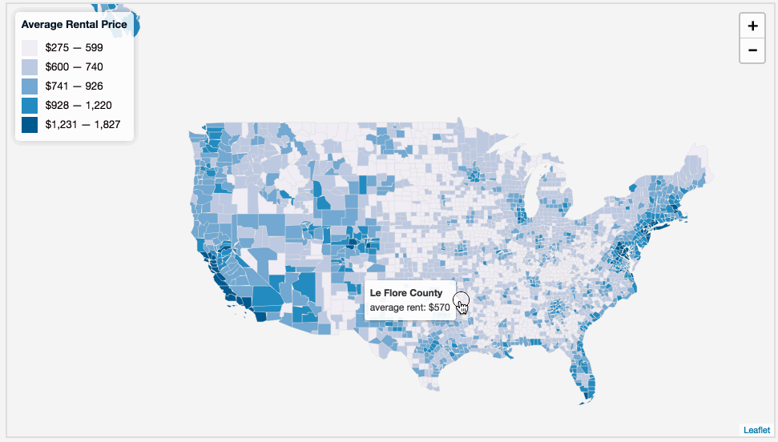

# Lab 09: Web Mapping A Choropleth Map

<!-- TOC -->

- [Lab 09: Web Mapping A Choropleth Map](#lab-09-web-mapping-a-choropleth-map)
    - [Overview](#overview)
    - [Part I: Rates of home ownership in Kentucky (4 pts)](#part-i-rates-of-home-ownership-in-kentucky-4-pts)
    - [Part II: Patterns of US rental prices (6 pts)](#part-ii-patterns-of-us-rental-prices-6-pts)
        - [Specific map requirements](#specific-map-requirements)
    - [Challenge (+1 pt)](#challenge-1-pt)

<!-- /TOC -->

## Overview

This lesson and lab will focus more on building choropleth maps using a variety of JavaScript libraries. We encourage you to explore the new libraries we introduce this week, jQuery and Simple Statistics.

## Part I: Rates of home ownership in Kentucky (4 pts)

Follow the lesson and complete a choropleth map of Kentucky home ownership by county.

## Part II: Patterns of US rental prices (6 pts)

Examine the contents of the *lab-09/* directory. This directory includes a starter template *index.html* file and a *data/counties_median_rent_2015.json* data file produced by joining data downloaded from [American FactFinder](https://factfinder.census.gov) with US county polygons downloaded from the [US Census Cartographic Boundary Shapefiles](https://www.census.gov/geo/maps-data/data/cbf/cbf_counties.html).

You'll notice that each county has two attribute properties: a "NAME" and a "RENT", the latter of which is the median gross rent within the county. Also, check for polygons that have `null` values for the RENT attribute.

Use this file to build a choropleth web map of US rental prices per county. It should look like this and include a tooltip or popup that displays the name of the county, the attribute being mapped (i.e., "median rent"), and the value of that attribute for that county.

*Lab 09 Solution*

Use the lesson for guidance and edit the *lab-09/index.html* to fulfill the requirements listed here.

### Specific map requirements

* Map should draw data from the *counties_median_rent_2015.json* file as a choropleth map with 5 to 7 classes, showing median gross rent values as a color gradient
* Map should have a clear legend that shows the color and values (incorrect units) of your class
* When the user mouses over count, a tooltip or popup will provide the name of the county and average rent value
* Page should have updated title and metadata information
* Code should be well-structured with indentions, comments, and meaningful variable and function names

## Challenge (+1 pt)

* Add a state outline layer to help readers determine state boundaries. Find a 1:20-million resolution layer at *data/us_states_20m.geojson*.
* Create a full-screen map with your metadata stored in a hidden element that can be enabled by a button. Follow the lesson addendum to finish the challenge.

Commit your work as you go, push to your repository, and submit the link within Canvas by the due date.
